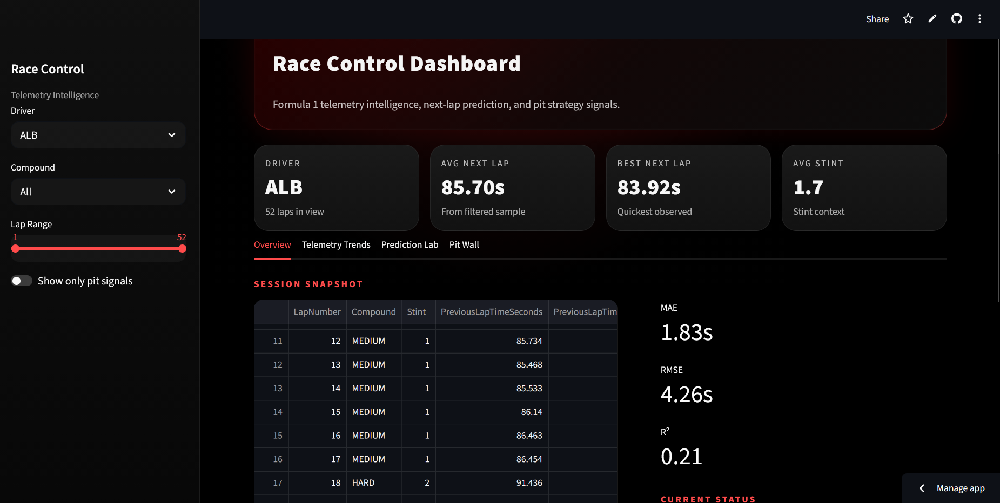
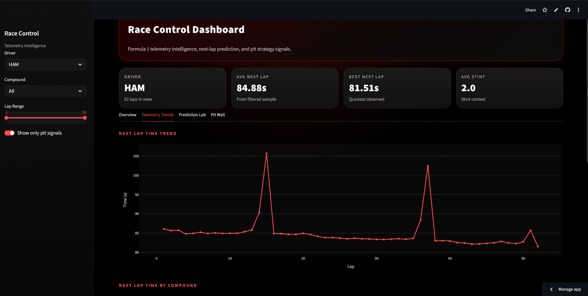
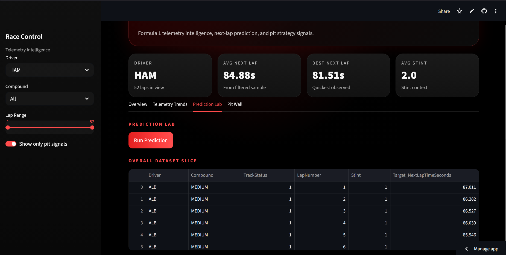
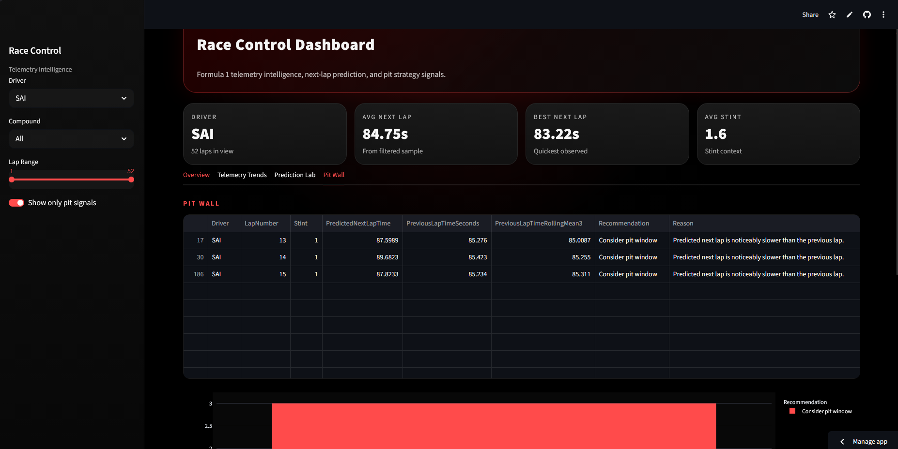

# 🏎️ Formula Racing Telemetry Intelligence System

An AI-powered motorsport analytics platform for collecting, processing, and analyzing Formula 1 telemetry data using machine learning and interactive visual analytics.

The project combines telemetry engineering, predictive modeling, race strategy analysis, and a Formula 1 inspired dashboard experience into a complete end-to-end motorsport intelligence system.

---

# 🌐 Live Demo

## Streamlit Dashboard
https://shaeeshb-formula-racing-telemetry-intel-appstreamlit-app-9rcfl7.streamlit.app/

---

# 📊 Core Features

## Telemetry Pipeline
- Formula 1 telemetry collection using FastF1
- Multi-session race ingestion pipeline
- Combined and per-driver race exports
- Local telemetry caching system

## Data Engineering
- Automated preprocessing pipeline
- Race data cleaning and normalization
- Feature engineering for predictive modeling
- Rolling statistics and race progression metrics

## Machine Learning
- Leakage-free next-lap prediction system
- Multiple regression baseline models
- Model evaluation and comparison
- Persistent trained model storage

## Race Analytics
- Tire degradation analysis
- Lap-time trend visualization
- Compound performance analysis
- Pit strategy recommendation engine

## Interactive Dashboard
- F1-inspired Race Control UI
- Driver and compound filtering
- Interactive telemetry visualization
- Prediction and strategy insights
- Race-control style dashboard experience

---

# 🧠 Machine Learning Pipeline

The project currently includes:

- Feature engineering pipeline
- Regression-based lap prediction
- Strategy-oriented analytics
- Baseline model comparison

## Models Implemented

- Linear Regression
- Random Forest Regressor
- HistGradientBoosting Regressor

## Current Best Model Performance

| Metric | Value |
|---|---|
| MAE | ~1.83s |
| RMSE | ~4.26s |
| R² | ~0.21 |

---

# 🖥️ Dashboard Overview

The Streamlit dashboard provides:

- Driver filtering
- Tire compound selection
- Lap-range controls
- Next-lap trend analysis
- Compound comparison visualizations
- Prediction inspection
- Pit strategy recommendations
- Race-control style interface

---

# 🛠️ Tech Stack

## Languages
- Python

## Data & Machine Learning
- Pandas
- NumPy
- Scikit-learn
- FastF1

## Visualization & Dashboard
- Plotly
- Matplotlib
- Streamlit

## Development Tools
- Git
- GitHub
- VS Code

---

# 📂 Project Structure

```text
Formula-Racing-Telemetry-Intelligence-System/
│
├── app/
│   └── streamlit_app.py
│
├── data/
│   ├── raw/
│   └── processed/
│
├── models/
│
├── notebooks/
│   ├── 01_day1_fastf1_test.py
│   ├── 02_day2_collect_data.py
│   └── 03_day3_eda.py
│
├── reports/
│   └── figures/
│
├── scripts/
│   ├── day4_feature_engineering.py
│   ├── day5_train_model.py
│   └── day6_evaluate_and_strategy.py
│
├── src/
│   ├── config.py
│   ├── data_loader.py
│   └── preprocess.py
│
├── requirements.txt
├── .gitignore
└── README.md
````

---

# 🚀 Local Setup

## 1. Clone the Repository

```bash
git clone https://github.com/ShaeeshB/Formula-Racing-Telemetry-Intelligence-System.git
cd Formula-Racing-Telemetry-Intelligence-System
```

---

## 2. Create Virtual Environment

### Windows PowerShell

```powershell
python -m venv .venv
.venv\Scripts\Activate.ps1
```

---

## 3. Install Dependencies

```bash
pip install -r requirements.txt
```

---

## 4. Run the Dashboard

```bash
streamlit run app/streamlit_app.py
```

---

# 📈 Current Capabilities

The system can currently:

* Load Formula 1 sessions using FastF1
* Cache telemetry data locally
* Export combined race CSVs
* Export per-driver telemetry CSVs
* Process and clean raw telemetry
* Generate engineered ML features
* Train lap prediction models
* Evaluate predictive performance
* Generate pit strategy recommendations
* Visualize telemetry using an interactive dashboard

---

# 🔮 Planned Improvements

## Telemetry Expansion

* Throttle trace analysis
* Brake trace visualization
* Sector delta comparison
* Corner-by-corner analysis

## Advanced Machine Learning

* XGBoost and LightGBM models
* Sequence-based telemetry prediction
* LSTM race modeling
* Tire wear forecasting

## Strategy Systems

* Undercut/overcut simulation
* Fuel strategy estimation
* Safety car simulations
* Race outcome simulation engine

## Dashboard Enhancements

* Real-time telemetry streaming
* Multi-driver comparison mode
* Live leaderboard simulation
* Advanced interactive analytics

---

# 📸 Screenshots

## Race Control Dashboard

### Dashboard Overview


---

### Telemetry Trends


---

### Prediction Lab


---

### Pit Wall

---

# 📌 Project Status

✅ Telemetry Pipeline Complete
✅ Feature Engineering Complete
✅ Baseline ML Pipeline Complete
✅ Strategy Recommendation System Complete
✅ Streamlit Dashboard MVP Complete
✅ Cloud Deployment Complete

---

# 👨‍💻 Author

Shaeesh Bhowmik

---

# 📄 License

This project is intended for educational, research, and portfolio purposes.

```
```
